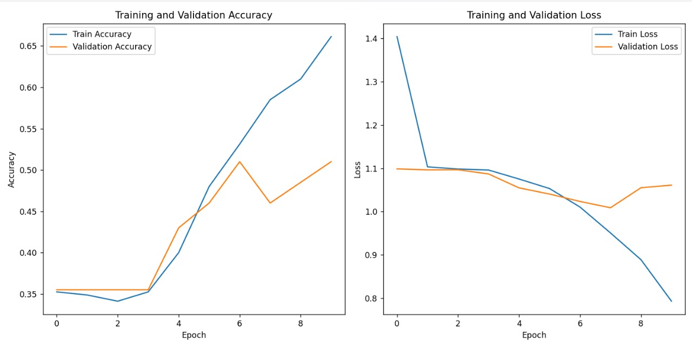

# 📊 Crowd Density Classification using CNN

Welcome to the **Crowd Density Classification** project! 🎉 This repository contains a Convolutional Neural Network (CNN) model to classify crowd density in images using the **JHU-CROWD++ dataset**. 📷

---

## 🚀 Features

- **Automated Preprocessing** 🛠️ - Images are resized, normalized, and labeled automatically.
- **CNN Architecture** 🧠 - Using multiple convolutional layers with dropout to avoid overfitting.
- **Early Stopping** ⏹️ - Automatically stops training when no improvement is seen.
- **Training Visualization** 📈 - Plots loss and accuracy graphs for evaluation.
- **Image Prediction** 🔍 - Predict crowd density from any input image.

---

## 🛠️ Prerequisites

Ensure you have the following installed before running the project:

- Python 3.x 🐍
- TensorFlow/Keras 🤖
- NumPy ➕
- Pandas 📊
- Matplotlib 📉
- PIL (Pillow) 🖼️

Install dependencies with:
```bash
pip install tensorflow numpy pandas matplotlib pillow
```

---

## ⚙️ How to Run

### 1️⃣ Clone the repository
```bash
git clone https://github.com/yourusername/crowd-density-cnn.git
cd crowd-density-cnn
```

### 2️⃣ Modify Dataset Paths
Update the paths to your dataset in `cnn_model.py`:
```python
# Example
dataset_path = r"C:\JHU_CROWD++_DATASET\jhu_crowd_v2.0\train\images"
labels_file_path = r"C:\JHU_CROWD++_DATASET\jhu_crowd_v2.0\train\image_labels.txt"
```

### 3️⃣ Train the Model 🏋️
Run the script to train the model:
```bash
python cnn_model.py
```

### 4️⃣ Evaluate Model 🧪
After training, the model's accuracy and loss will be displayed.

### 5️⃣ Make Predictions 🔮
Test the trained model on a new image:
```python
predicted_label = predict_image("cnn_model.h5", "test_image1.jpeg")
print(f"Predicted Class: {predicted_label}")
```

---

## 🏗️ Model Architecture

- **Input Layer:** 224x224 RGB Images
- **Conv2D (32 filters, 3x3 kernel)** ➡️ **MaxPooling (2x2)** ➡️ Dropout (0.1)
- **Conv2D (64 filters, 3x3 kernel)** ➡️ **MaxPooling (2x2)** ➡️ Dropout (0.2)
- **Conv2D (128 filters, 3x3 kernel)** ➡️ **MaxPooling (2x2)** ➡️ Dropout (0.3)
- **Fully Connected Layer (128 neurons)** ➡️ Dropout (0.7)
- **Output Layer (Softmax activation for 3 classes)**

---

## 📊 Results




The model achieves satisfactory accuracy on the test set with early stopping enabled.

---

## 📝 Acknowledgments

Special thanks to the creators of the **JHU-CROWD++** dataset. 🙌

---

## 📧 Contact

If you have any questions, feel free to reach out:

📩 Email: nekunj44@gmail.com  
🌐 GitHub: [YourGitHubProfile](https://github.com/nekunj44)

---

### 🌟 Don't forget to star this repo if you found it useful! ⭐

