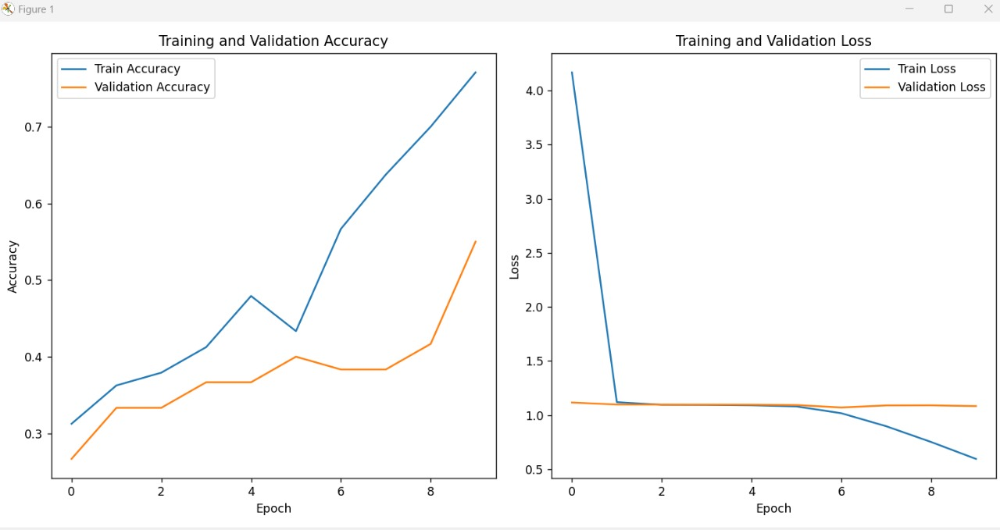

# 📊 Crowd Density Classification using CNN

Welcome to the **Crowd Density Classification** project! 🎉 This repository contains a Convolutional Neural Network (CNN) model to classify crowd density in images using the **ShanghaiTech dataset**. 📷

---

## 🚀 Features

- **Automated Preprocessing** 🛠️ - Images are resized, normalized, and labeled automatically.
- **CNN Architecture** 🧠 - Using multiple convolutional layers with dropout to avoid overfitting.
- **Early Stopping & Learning Rate Reduction** ⏹️ - Automatically stops training and adjusts learning rate.
- **Training Visualization** 📈 - Plots loss and accuracy graphs for evaluation.

---

## 🛠️ Prerequisites

Ensure you have the following installed before running the project:

- Python 3.x 🐍
- TensorFlow/Keras 🤖
- NumPy ➕
- Matplotlib 📉
- Pillow (PIL) 🎼
- SciPy ⚙️

Install dependencies with:
```bash
pip install tensorflow numpy matplotlib pillow scipy
```

---

## ⚙️ How to Run

### 1⃣ Clone the repository
```bash
git clone https://github.com/yourusername/crowd-density-cnn.git
cd crowd-density-cnn
```

### 2⃣ Modify Dataset Paths
Update the paths to your dataset in `cnn_model.py`:
```python
# Example
dataset_path = r"C:\shanghaitech\ShanghaiTech\part_A\train_data\images"
ground_truth_path = r"C:\shanghaitech\ShanghaiTech\part_A\train_data\ground-truth"
```

### 3⃣ Train the Model 🏅
Run the script to train the model:
```bash
python cnn_model.py
```

### 4⃣ Evaluate Model 🧠
After training, the model's accuracy and loss will be displayed.

### 5⃣ Visualize Results 🎨
The training and validation accuracy/loss graphs will be displayed.

---

## 🏗️ Model Architecture

- **Input Layer:** 224x224 RGB Images
- **Conv2D (32 filters, 3x3 kernel)** ➡️ **MaxPooling (2x2)** ➡️ Dropout (0.3)
- **Conv2D (64 filters, 3x3 kernel)** ➡️ **MaxPooling (2x2)** ➡️ Dropout (0.4)
- **Fully Connected Layer (128 neurons)** ➡️ Dropout (0.6)
- **Output Layer (Softmax activation for 3 classes)**

---

## 📊 Results



The model achieves satisfactory accuracy on the test set with early stopping and learning rate adjustments.

---

## 📝 Acknowledgments

Special thanks to the creators of the **ShanghaiTech** dataset. 🙌

---

## 📧 Contact

If you have any questions, feel free to reach out:

📩 Email: nekunj44@gmail.com  
🌐 GitHub: [YourGitHubProfile](https://github.com/nekunj44)

---

### 🌟 Don't forget to star this repo if you found it useful! ⭐

